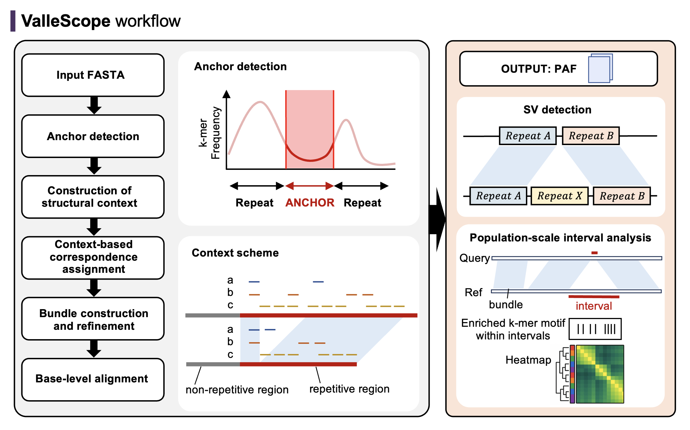

---

# ValleScope

*Context-based correspondence assignment for satellite DNA in telomere-to-telomere assemblies.*

> 🧬 **ValleScope** is a framework for assigning high-confidence assembly-to-assembly correspondences in highly repetitive arrays, including centromeric and pericentromeric α-satellite and HSat2.
>
> ValleScope does not aim to maximize continuous alignment coverage. Instead, it defines high-confidence correspondence blocks using tokenized structural contexts and a context-based assignment algorithm. The resulting ValleScope-defined correspondence intervals can be used for comparative analysis of satellite DNA structural variation and haplotype diversity.



---

## Quickstart

```bash
# 1. Clone
git clone https://github.com/hiura-censat/ValleScope.git
cd ValleScope

# 2. Run inside Docker
docker compose up -d

# 3. Run ValleScope on example input
docker compose run --rm runner run \
  --ref examples/demo_inputs/HG00513_hap1_chr10.hsat2.longest.fa.gz \
  --query   examples/demo_inputs/HG01596_hap1_chr10.hsat2.longest.fa.gz \
  -j 8
```
---

## Installation

### Option A: Docker (recommended)
- Build images:
```bash
git clone https://github.com/hiura-censat/ValleScope.git
cd ValleScope
docker compose up -d
```

### Option B: Local installation (advanced)
- Manually install:
```bash
git clone https://github.com/hiura-censat/ValleScope.git
cd ValleScope

conda create -n vallescope_dev --file envs/conda-linux-64.lock
conda activate vallescope_dev

python -m pip install -e .
vallescope --help
```
- Docker is highly recommended for full reproducibility.

---

## Usage

### Basic pairwise correspondence assignment

```bash
docker compose run --rm runner run \
  --ref reference.fa \
  --query query.fa \
  -j 8
```

or, for local installation:

```bash
vallescope run \
  --ref reference.fa \
  --query query.fa \
  -j 8
```

---

## Expected output

After running the demo command, ValleScope writes the results to the `results/` directory.

```text
results/
├── output.paf
├── output.syri_ready.paf
├── vs.bundles.png
├── *.filtered.anchors.bed
├── *.masked.freq.region.png
├── *.masked.freq_smooth.bw
├── anchor/
├── assemblies/
├── data/
└── plot/
```

The main output files are:

| File | Description |
|---|---|
| `output.paf` | ValleScope-defined high-confidence correspondence blocks in PAF format. |
| `output.syri_ready.paf` | PAF file formatted for downstream analysis. |
| `vs.bundles.png` | Visualization of ValleScope-defined correspondence anchors and bundles between the reference and query assemblies. |
| `*.filtered.anchors.bed` | BED files containing filtered anchor regions used for context-based correspondence assignment. |
| `*.masked.freq.region.png` | Regional visualization of the GenMap-derived k-mer frequency profile. |
| `*.masked.freq_smooth.bw` | Smoothed BigWig signal generated from the GenMap-derived frequency profile. |

For most users, the key files to inspect first are `output.syri_ready.paf`.

---

## Reproducibility

- **Containerization:** Docker is recommended for reproducible execution.
- **Version pinning:** Conda lock files are provided for local installation.
- **Parameter recording:** ValleScope records key parameters used for anchor detection, construction of token sequences, and correspondence assignment.
- **Manuscript archive:** Scripts, command logs, processed data, and figure-generation outputs supporting the manuscript analyses are archived in Zenodo: https://doi.org/10.5281/zenodo.20279198

---

## Citation

If you use ValleScope, please cite:

> Hiura N. et al. ValleScope: context-based correspondence assignment for satellite DNA in telomere-to-telomere assemblies. Manuscript in preparation.

The manuscript citation will be updated after publication. The manuscript reproducibility package is available at Zenodo: https://doi.org/10.5281/zenodo.20279198

---

## Contributing

Contributions, bug reports, and feature requests are welcome through GitHub Issues and Pull Requests.

---

## License

Licensed under the MIT License. See [LICENSE](LICENSE) for details.